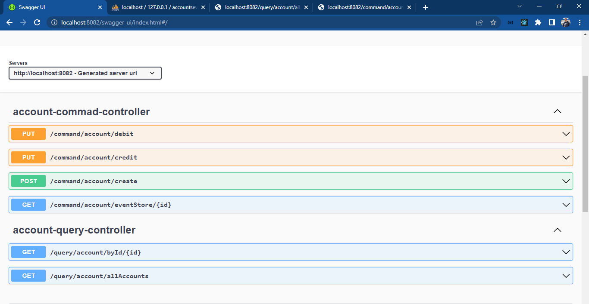
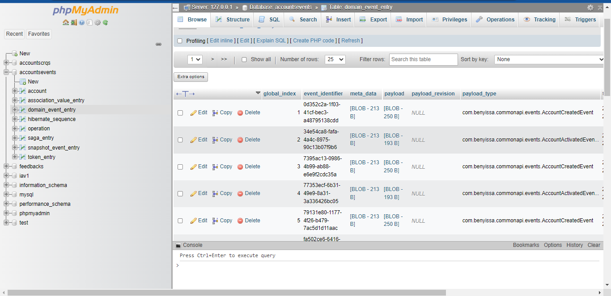
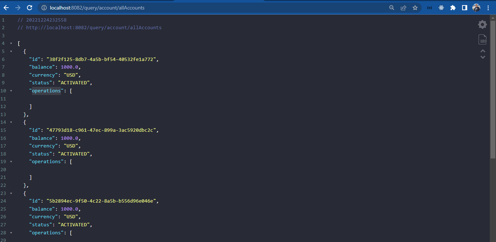
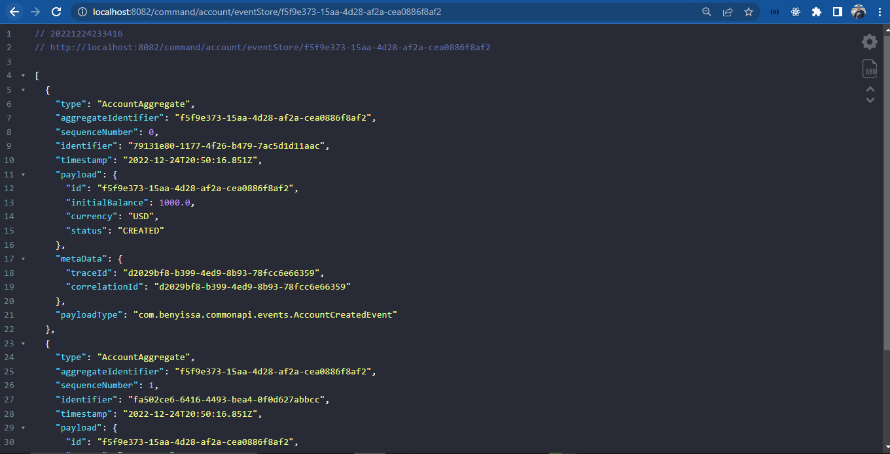
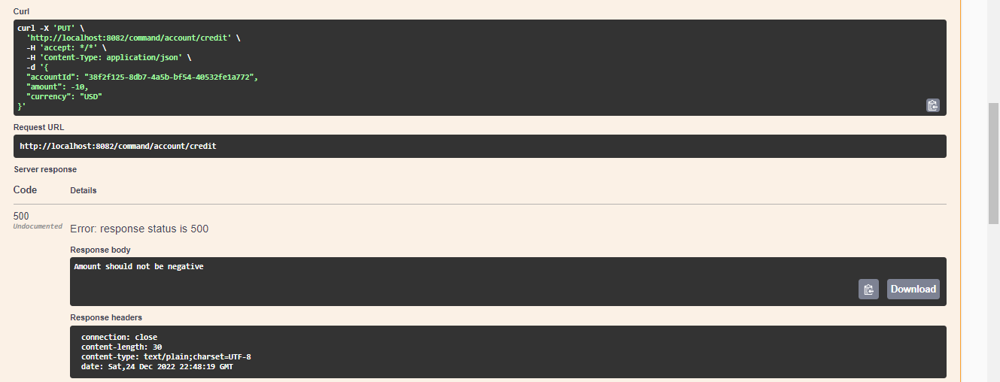
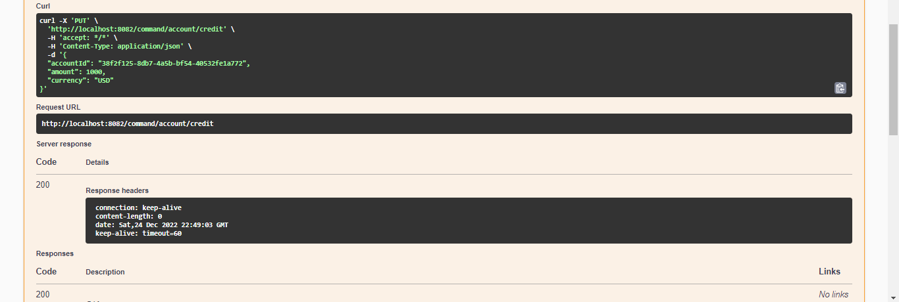

# Event Driven Architecture CQRS and Event Sourcing

Accounts and operations management using Axon Framework

## Table of contents

- [Project Architecture](#project-architecture)
- [Realisation](#realisation)

## Project Architecture

 

 

## Realisation

 

 

 

 

 

 

 

 

 

 

 

 

## 🔗 About me :

