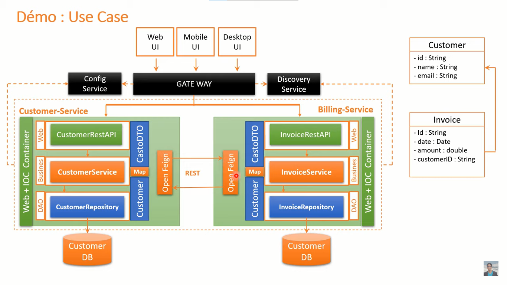
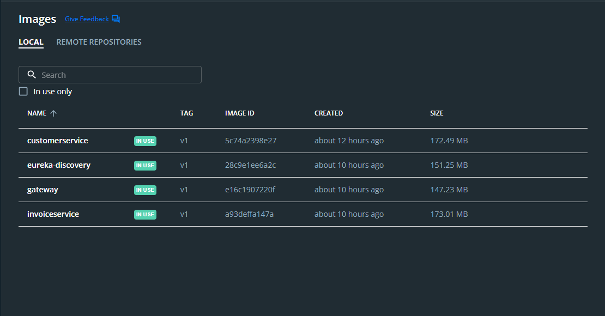
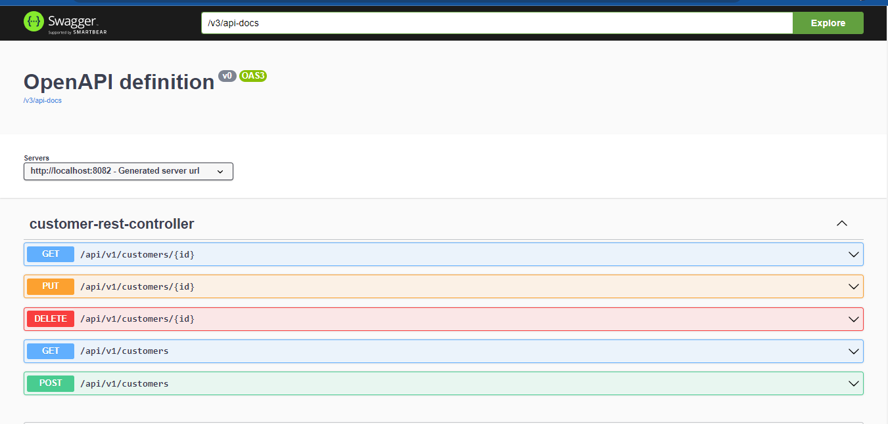
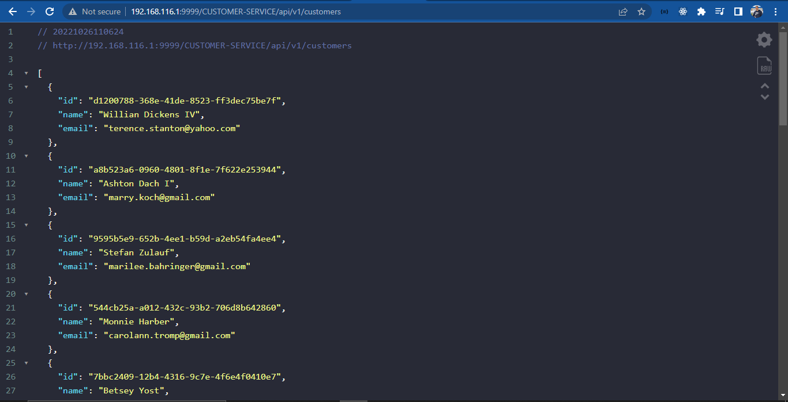
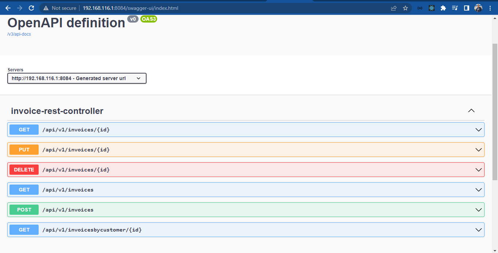
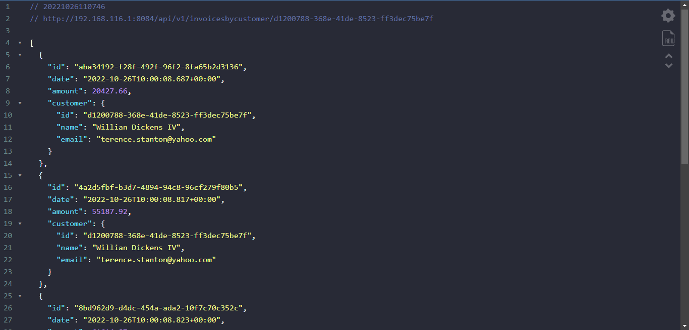
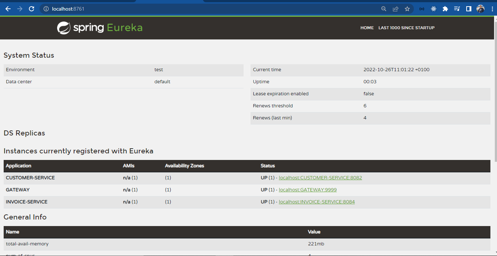

# Digital Banking Using Microservices architecture

customers and invoices Microservices using Spring boot and eureka.

## Table of contents

- [Project Architecture](#project-Structure)
- [Docker Images](#docker-images)
- [Customer Service](#customer-service)
- [Invoice Service](#invoice-service)
- [Eureka Disovery Service](#eureka-disovery-service)

## Project Architecture

In this project we have the following services:

    1. Customer Service :
        My job is not complicated ,I will handle CRUD operations for our customers ✔
    2. Invoice service :
        I will be here for handling CRUD operations for invoices ✔
    3. OpenFeign :
        I will get customer details if any invoice  ask me about them 🤷‍♂️
    4. Eureka Disovery Service :
        I will holds the information about customer and invoice services 😎
    5. Gateway :
        Your clients will send me their requests, then I will send it to the wanted service 😜

 

 

## Docker Images

 

 

## Customer Service

 

 

 

 

## Invoice Service

 

 

invoices for a specefic customer

 

 

## Eureka Disovery Service

 

 

## 🔗 About me :

