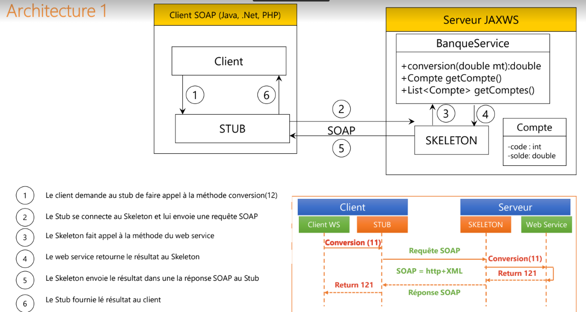

# SOAP WEB SERVICE USING JAX-WS

The Jakarta XML Web Services is a Jakarta EE API for creating web services, particularly SOAP services.

In this Project we will create a server for for connecting with a Bank webservice.
After that we will create a clinet application that consume our service using soap.

## Table of contents

- [Project Architecture](#project-architecture)
- [Web Service](#web-service)
- [Client Side](#client-side)

## Project Architecture

Our project have the following archeticture :

<br>

<br>

## Web Service

Our server is accessible via port : 9191

```java
public class ServerJWS {
    public static void main(String[] args) {
        Endpoint.publish("http://0.0.0.0:9191/", new BankService());
        System.out.println("Web server is running in http://0.0.0.0:9191/");
    }
}
```

Using SOAP Ui we will test the available methods of our Bank service :

<br>

<br>

<br>

<br>

<br>

<br>

<br>

<br>

## Client Side

Let's test the Bank Web Service with a real client :

```java

public class Client {
    public static void main(String[] args) {
        System.out.println("Hello, I am a soap client , let's test the BankWebService");
        BankService stub = new BankWebService().getBankServicePort();
        System.out.println(stub.convertToMAD(10));
    }
}
```

<br>

<br>

## © Video Source ✌ :
https://www.youtube.com/watch?v=ig5UHI12HPs


## 🔗 About me :

[](https://www.linkedin.com/in/hamzaaitbenyissa/)
[](https://twitter.com/h_aitbenyissa)
[](https://benyissa.com)
